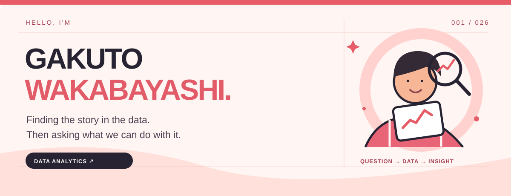
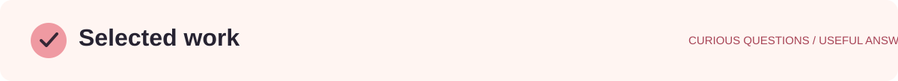
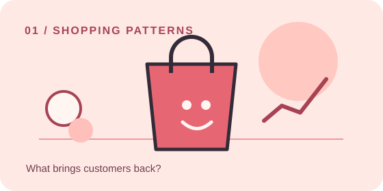
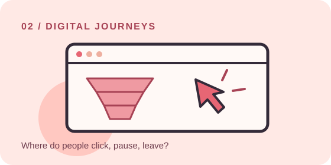

<!-- GitHub profile repository: gaku213waka/gaku213waka -->

  

 

  <b>こんにちは、若林岳人です。</b> 
  東京電機大学で情報分野を学びながら、データの中にある「なぜ？」を探しています。 
  SQLとPythonで傾向を捉え、伝わる可視化と次の一手につなげるのが好きです。

 

  

 

<table>
  <tr>
    <td width="50%" valign="top">
      
      <h3><a href="https://github.com/gaku213waka/ecommerce-sales-analysis">01 / E-commerce sales analysis ↗</a></h3>
      
ECの購買データから顧客の動きを観察。RFM分析とコホート分析を通じて、売上につながる施策を考えました。

      RFM · COHORT · CUSTOMER ANALYTICS
    </td>
    <td width="50%" valign="top">
      
      <h3><a href="https://github.com/gaku213waka/User_Behavior_Analysis">02 / User behavior analysis ↗</a></h3>
      
流入から購入までのユーザー行動を分析。チャネル、デバイス、ファネルを見て、改善の糸口を探しました。

      BIGQUERY · FUNNEL · DIGITAL ANALYTICS
    </td>
  </tr>
</table>

 

  

 

<table>
  <tr>
    <td width="33%" valign="top"><b>01 / Explore</b>  Python · pandas SQL · PostgreSQL BigQuery</td>
    <td width="33%" valign="top"><b>02 / Understand</b>  EDA · RFM · Cohort Matplotlib · Tableau scikit-learn</td>
    <td width="33%" valign="top"><b>03 / Build</b>  Snowflake · dbt Docker · GitHub Streamlit</td>
  </tr>
</table>

 

  

