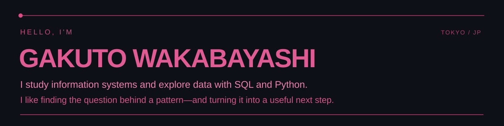
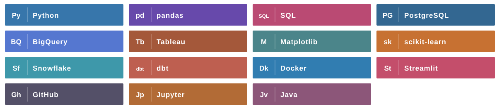

<!-- Profile README for github.com/gaku213waka -->

  

 

### Selected work

<table>
  <tr>
    <td width="110" align="center"></td>
    <td>
      <strong><a href="https://github.com/gaku213waka/ecommerce-sales-analysis">E-commerce sales analysis ↗</a></strong> 
      Customer purchasing patterns through RFM and cohort analysis, with ideas for improving retention and sales. 
      Python · SQL · RFM · Cohort analysis
    </td>
  </tr>
  <tr>
    <td width="110" align="center"></td>
    <td>
      <strong><a href="https://github.com/gaku213waka/User_Behavior_Analysis">User behavior analysis ↗</a></strong> 
      Exploring traffic sources, devices, and the path to purchase to find where users drop off. 
      BigQuery · Funnel analysis · Visualization
    </td>
  </tr>
</table>

 

### Tech stack

 

### On my desk — in progress

**Hotel booking cancellation analysis**  
Exploring what drives cancellations and building a prediction model using information available at booking time. The analysis is still in progress; findings and code will be shared when it is ready.

Tokyo, Japan · Ask better questions. Make clearer decisions.
