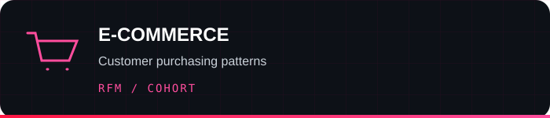
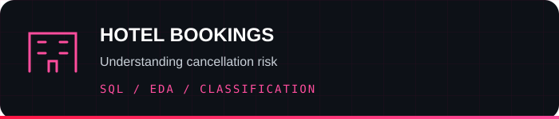

  
   
  
   
  

## 🌸 About Me

I'm **Gakuto Wakabayashi**, an Information Systems Engineering student at **Tokyo Denki University** in Japan.

I enjoy exploring data, finding patterns, and turning them into ideas that support better decisions. My interests include **data analytics, business insights, and visualization**. I'm also learning how data engineering supports reliable analysis.

- 📊 Analyze customer behavior and business performance with SQL and Python.
- 🔎 Connect questions, evidence, and practical improvement ideas.
- 🏨 Currently working on hotel booking cancellation analysis.

## ⚡ Tech Stack

  

 

## 🔥 Featured Projects

Explore customer purchasing patterns through **RFM segmentation and cohort analysis**, with a focus on retention and business improvement ideas.

**Tools:** SQL · Python · pandas · Visualization  
[Explore the project →](https://github.com/gaku213waka/ecommerce-sales-analysis)

Analyze acquisition channels, devices, and the purchase funnel to identify **where users drop off** and explore improvement opportunities.

**Tools:** BigQuery · SQL · Python · Visualization  
[Explore the project →](https://github.com/gaku213waka/User_Behavior_Analysis)

## 🚧 Currently Building

**Hotel Booking Cancellation Analysis** — Exploring cancellation patterns and building a classification model using information available at booking time.

**Workflow:** SQL aggregation → Python EDA → Modeling → Business insights

## 📊 GitHub Analytics

  

## 📈 Contribution Activity

## 🐍 Contribution Snake

## 🌆 3D Contribution Skyline

 
<b>Thanks for visiting!</b>
  

